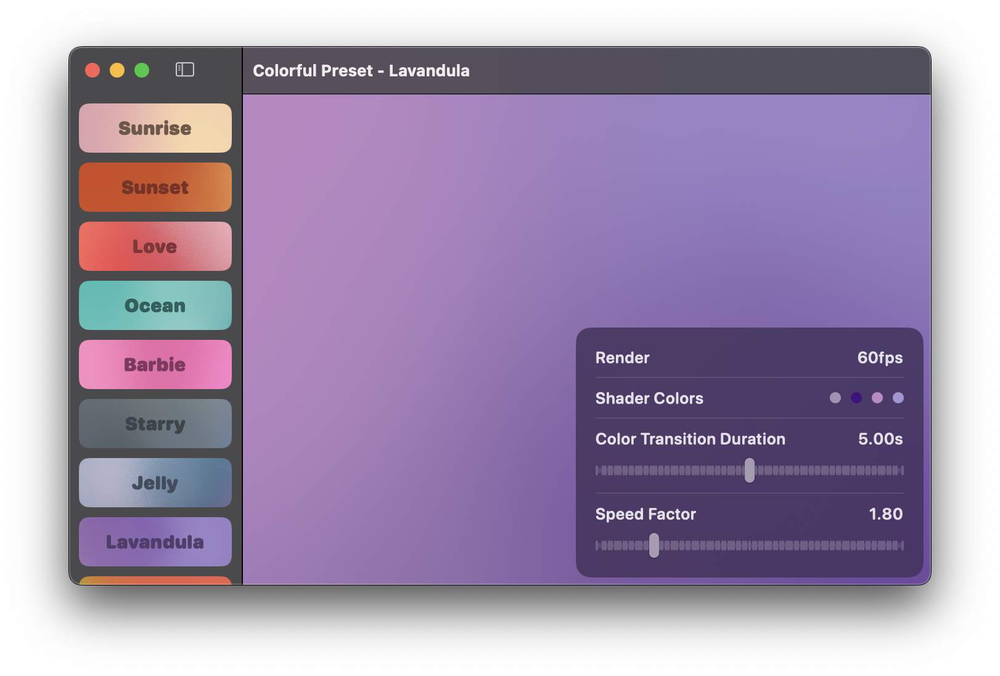
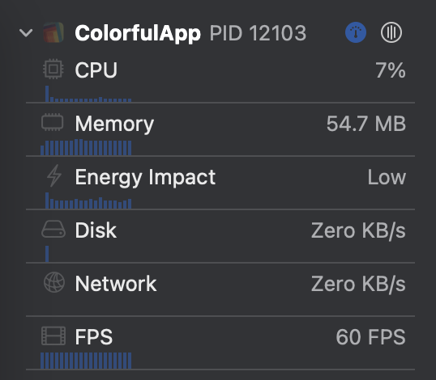

# ColorfulX

ColorfulX is an implementation using Metal for crafting multi-colored gradients.



## What's New

- Version 2.3.1
    - Fixed a compilation issue on Xcode 14 and iOS 15

- Version 2.3.0
    - Fixed a memory leak on UIKit caused by CADisplayLink holding ref to self.

- Version 2.2.18
    - Fixed first frame rendering being delayed after a run loop casing a flash.

- Version 2.2.14
    - Fixed drawable present crashing in rare cases.
    - Frame limit is relaxed to unlimited by default.
    - Render will only take place after previous frame complete.

- Version 2.2.12
    - Delayed vsync to a background thread to avoid magic with SwiftUI.

- Version 2.2.11
    - Fixed rendering task backlog causing lag in rare cases.

- Version 2.2.9
    - Fixed a performance issue caused by vsync receiving more than expected.
    - ~~Frame Limit is now configured to 60 FPS by default.~~
    - Frame Limit is now provided as an option to configure.
    - Use 1x scale for any kind of view (for better performance).

In this release, a test is performed to see the real-world case of the rendering cost. A full-size view with 1x scale, 430x932, will mostly be rendered within 4ms. As observed, the average is 1.41ms. The test is performed on iPhone 15 Pro Max. We suggest no more than 2x scale and 60 FPS to avoid hurting the device.

- Version 2.2.4
    - Switched to LCH color space for animated transition.

- Version 2.2.1
    - API changed and stabilized.
    - Option to configure noise.
    - Option to configure fps removed. We are now syncing refresh rate with system.
    - Animation speed now stabilized.
    - Demo app downgraded to iOS 15.0. See #1.

## Platform

UIKit and AppKit platforms are generally supported.

```
platforms: [
    .iOS(.v14),
    .macOS(.v11),
    .macCatalyst(.v14),
    .tvOS(.v14),
    .visionOS(.v1), // supported from 2.1.0
],
```

## Usage

Add this package into your project.

```swift
dependencies: [
    .package(url: "https://github.com/Lakr233/ColorfulX.git", from: "2.2.1"),
]
```

For more detailed information, feel free to explore our example projects. We've provided various presets for your convenience. Each one is identifiable within the demo application. For instance, check out `ColorfulPreset` to find the name, and then use `.constant(preset.colors)` to implement it in `ColorfulView`.

### SwiftUI

For animated colors with default animation, use the following code:

```swift
import ColorfulX

struct ContentView: View {
    // Just use [SwiftUI.Color], available up to 8 slot.
    @State var colors: [Color] = ColorfulPreset.aurora.colors

    var body: some View {
        ColorfulView(color: $colors)
            .ignoresSafeArea()
    }
}
```

Parameters to control the animation are follow:

```
@Binding var colors: [Color]
@Binding var speed: Double
@Binding var noise: Double
@Binding var transitionInterval: TimeInterval

ColorfulView(
    color: $colors,
    speed: $speed,
    noise: $noise,
    transitionInterval: $duration
)
```

For creating a static gradient, **parse `speed: 0` to `ColorfulView`**, or use the following code:

```swift
import ColorfulX

struct StaticView: View {
    var body: some View {
        MulticolorGradient(parameters: .constant(.init(
            points: [
                .init(color: .init(.init(Color.red)), position: .init(x: 0, y: 0)),
                .init(color: .init(.init(Color.blue)), position: .init(x: 1, y: 0)),
                .init(color: .init(.init(Color.green)), position: .init(x: 0, y: 1)),
                .init(color: .init(.init(Color.yellow)), position: .init(x: 1, y: 1)),
            ],
            bias: 0.01,
            power: 4,
            noise: 32
        )))
    }
}
```

### UIKit/AppKit

For animated colors with default animation, use the following code:

```swift
import MetalKit
import ColorfulX

let view = AnimatedMulticolorGradientView()
view.setColors(color, interpolationEnabled: false)
view.speed = speed
view.transitionDuration = transitionDuration
view.noise = noise
```

For creating a static gradient, use the following code:

```swift
import MetalKit
import ColorfulX

let view = MulticolorGradientView()
view.parameters = .init(points: [
    .init(color: .init(r: 1, g: 0, b: 0), position: .init(x: 1, y: 0)),
    .init(color: .init(r: 0, g: 1, b: 0), position: .init(x: 0, y: 0)),
    .init(color: .init(r: 0, g: 0, b: 1), position: .init(x: 0, y: 1)),
    .init(color: .init(r: 1, g: 1, b: 1), position: .init(x: 1, y: 1)),
], bias: 0.01, power: 2, noise: 32)
```

## Performance

There's no feasible way to create these types of gradients without incurring some costs. Yet, by utilizing Metal and GPU, we can attain a performance level that's quite satisfactory. The render process will only take place when draw parameters changed.

After all, the energy impact of this approach is classified as 'Low'.

From my perspective, it would be advisable to implement a single view per application and opt for a static gradient whenever possible, as this could offer a more efficient solution. Just set the `speed` to `0`.



## License

This project is licensed under the MIT License - see the [LICENSE](LICENSE) file for details

The shader code originates from [this source](https://github.com/ArthurGuibert/SwiftUI-MulticolorGradient). Consequently, the name of the original author has been credited in the license file.

---

Copyright © 2023 Lakr Aream. All Rights Reserved.
