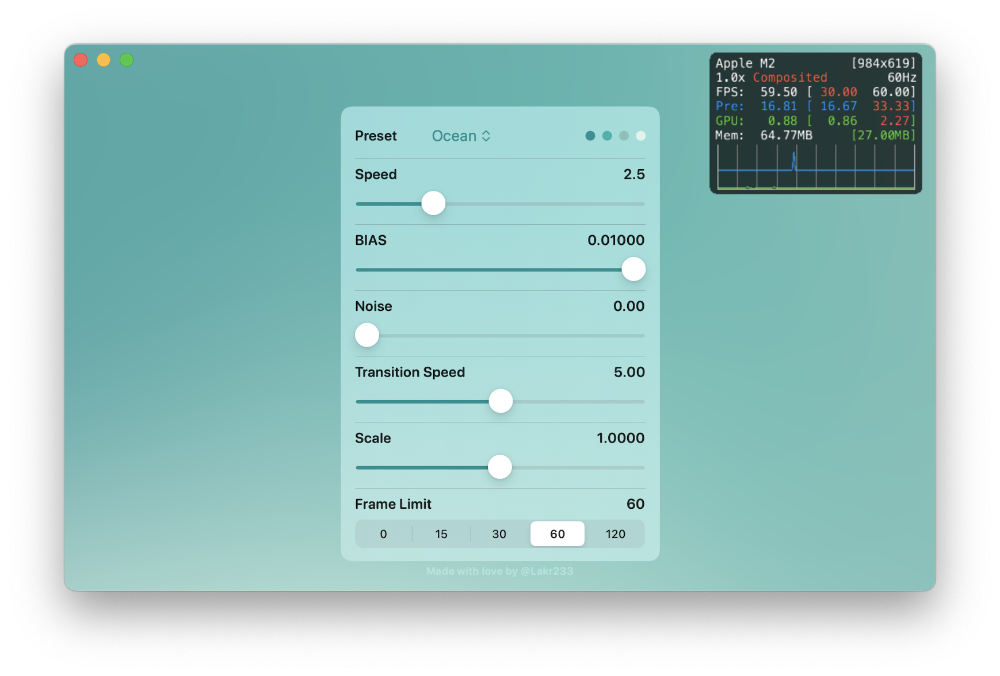

# ColorfulX

ColorfulX is an implementation using Metal for crafting multi-colored gradients.



## Special Thanks

The code here is significantly reused from [this source](https://github.com/ArthurGuibert/SwiftUI-MulticolorGradient), thus the name of original author was added to license file.

**The primary focus of this repository is to extend support across multiple platforms, offering a range of ready-to-use presets.**

## Platform

UIKit and AppKit platforms are generally supported. Due to `MTKView` not available on visionOS, it's not supported.

```
platforms: [
    .iOS(.v14),
    .macOS(.v14),
    .macCatalyst(.v14),
    .tvOS(.v15),
]
```

## Usage

Add this package into your project.

```swift
dependencies: [
    .package(url: "https://github.com/Lakr233/ColorfulX")
]
```

### SwiftUI

For animated colors with default animation, use the following code:

```swift
ColorfulX(
    colors: ColorSet, // 3 colors are required
    speedFactor: Float = 1,
    bias: Float = 0.001,
    noise: Float = 128,
    power: Float = 8,
    colorInterpolation: MulticolorGradient.ColorInterpolation = .hsb
)
```

For creating a static gradient, use the following code:

```swift
MulticolorGradient(
    points: [ColorStop],
    bias: Float = 0.001,
    power: Float = 2.0,
    noise: Float = 2.0,
    colorInterpolation: ColorInterpolation = .rgb
)
```

> Personally, I prefer to use hsb as color interpolation as it's more natural to human eyes.

## License

This project is licensed under the MIT License - see the [LICENSE](LICENSE) file for details

---

Copyright © 2023 Lakr Aream. All Rights Reserved.
